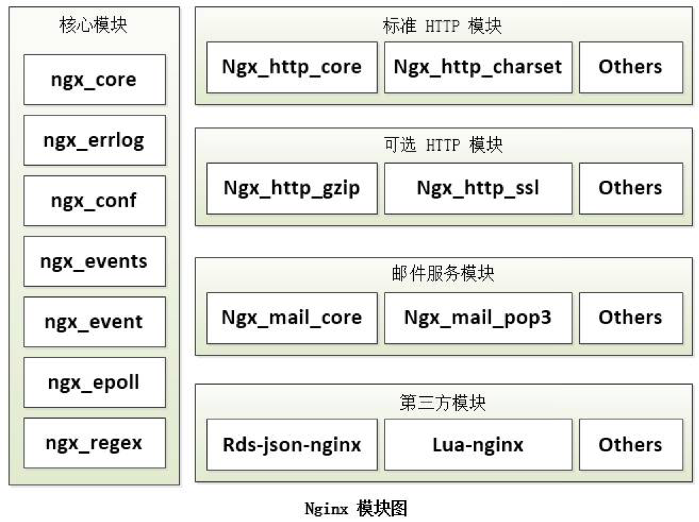
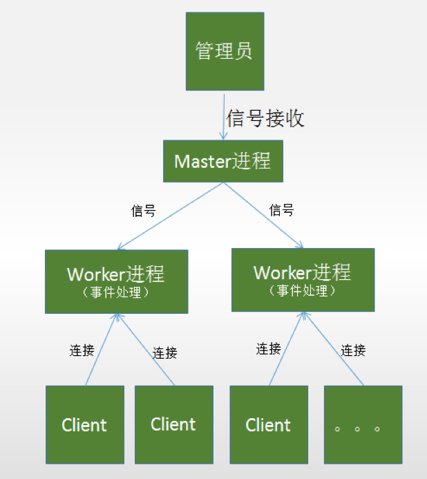

# Nginx概述

### 一. Nginx简介

Nginx(发音为"engine X")是俄罗斯人编写的十分轻量级的HTTP 服务器，是一个高性能的HTTP和反向代理服务器，同时也是一个IMAP/POP3/SMTP 代理服务器。

Nginx 因为它的稳定性、丰富的模块库、灵活的配置和低系统资源的消耗而闻名。业界一致认为它是Apache2.2＋mod_proxy_balancer 的轻量级代替者，不仅是因为响应静态页面的速度非常快，而且它的模块数量达到Apache 的近2/3。对proxy 和rewrite 模块的支持很彻底，还支持mod_fcgi、ssl、vhosts ，适合用来做mongrel clusters 的前端HTTP 响应。

目前Nginx在国内很多大型企业都有应用，且普及率呈逐年上升趋势。Nginx的优势如下：

1. 它可以支持5W高并发连接；
2. 内存消耗少；
3. 成本低。

### 二. 应用场景

1. 网关

   面向客户访问的总入口

2. 虚拟主机

   一台Nginx同时为多个{域名：端口}提供服务

3. 路由和反向代理

   提供反向代理，整合一系列服务

4. 静态服务器

   提供对前端页面、样式等静态资源的访问

5. 集群负载均衡

   使用upstream，负载多个Web Server(如Tomcat)

### 三. 架构设计

1. 模块化设计

   **高度模块化的设计是Nginx 的架构基础**。Nginx 服务器被分解为多个模块，每个模块就是一个功能模块，只负责自身的功能，模块之间严格遵循“高内聚，低耦合”的原则。

   

   1. **核心模块**

      核心模块是Nginx 服务器正常运行必不可少的模块，提供错误日志记录、配置文件解析、事件驱动机制、进程管理等核心功能。

   2. **标准HTTP模块**

      标准HTTP 模块提供HTTP 协议解析相关的功能，如：端口配置、网页编码设置、HTTP 响应头设置等。

   3. 可选HTTP模块

      可选HTTP 模块主要用于扩展标准的HTTP 功能，让Nginx 能处理一些特殊的服务，如：Flash 多媒体传输、解析GeoIP 请求、SSL 支持等。

   4. 邮件服务模块

      邮件服务模块主要用于支持Nginx 的邮件服务，包括对POP3 协议、IMAP 协议和SMTP 协议的支持。

   5. 第三方模块

      第三方模块是为了扩展Nginx 服务器应用，完成开发者自定义功能，如：Json支持、Lua 支持等。

2. Master-Worker多进程模型

   

   Nginx服务器每当收到一个客户端请求时，就由服务器主进程(Master)生成一个子进程(Worker)出来和客户端建立连接进行交互，直到连接断开，该子进程才结束。

   **多进程模式的优势**：

   1. 各个进程之间相互独立，不需要加锁，减少了资源竞争对性能造成影响；
   2. 进程互相之间不会影响，如果一个进程发生异常退出时，其它进程仍然可以正常工作，Master进程则很快启动新的Worker进程，确保服务不中断，将风险降到最低；
   3. 降低编程的复杂度，降低开发成本。

   **多进程模式的缺点**：

   1. 操作系统生成一个子进程需要进行内存复制等操作，在资源和时间上会产生一定的开销；
   2. 当有大量请求时，创建大量的进程，会导致系统性能下降。

3. epoll模式

   相较于传统的select和poll模式，epoll的优势如下：

   1. 支持一个进程打开大数目的socket描述符(FD)；
   2.  IO效率不随FD数目增加而线性下降；
   3. 使用mmap加速内核与用户空间的消息传递。

4. 正向代理 VS 反向代理

   1. 代理(正向代理)：指一个位于客户端和原始服务器(origin server)之间的服务器，为了从原始服务器取得内容，客户端向代理发送一个请求并指定目标(原始服务器)，然后代理向原始服务器转交请求并将获得的内容返回给客户端。

      **正向代理是顺着请求的方向进行的代理，主要是为客户端服务的。**

   2. 反向代理：实际运行方式是指以代理服务器来接受internet上的连接请求，然后将请求转发给内部网络上的服务器，并将从服务器上得到的结果返回给internet上请求连接的客户端，此时代理服务器对外就表现为一个服务器。

      **反向代理是为内部服务器服务的。**

### 四. 安装

1. 下载源码包，并解压

   ```shell
   wget  http://nginx.org/download/nginx-1.15.8.tar.gz
   tar -zxvf nginx-1.15.8.tar.gz
   cd nginx-1.15.8
   ```

2. 配置

   ```shell
   ./configure   --prefix=/usr/local/nginx --with-http_stub_status_module --with-http_ssl_module
   ```

3. 编译并安装

   ```shell
   make && make install 
   ```

### 五. 常用命令

1. 启动

   ```shell
   ./nginx (-c nginx.conf的文件) #如果不指定，默认为NGINX_HOME/conf/nginx.conf
   ```

2. 停止

   ```shell
   ./nginx -s stop
   ```

3. 退出

   ```shell
   ./nginx -s quit
   ```

4. 重新加载配置

   ```shell
   ./nginx -s reload
   ```

5. 检查配置

   ```shell
   ./nginx -t
   ```

   

